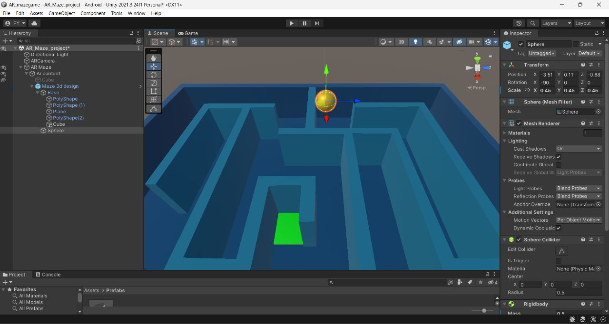

# 🎮 AR Maze Game

An immersive **Augmented Reality (AR) maze game** that combines 3D game design with cutting-edge AR technology. Navigate a dynamic 3D maze using real-world physics, where the maze appears in your real environment through your mobile device's camera.

---

## 📋 Project Overview

**AR Maze Game** is an innovative gaming experience that leverages augmented reality and physics-based mechanics to create an engaging and interactive maze adventure. The game challenges players to navigate a complex 3D maze while avoiding obstacles and traps, all within an immersive AR environment.


## 🎮 Gameplay

- **Objective**: Navigate the golden ball from the maze entrance to the exit
- **Controls**: Tilt your device to roll the ball through the maze
- **Obstacles**: Avoid stationary and dynamic traps along the way
- **Strategy**: Find the optimal path while managing the ball's momentum

### 📸 Game Preview



*3D maze environment with physics-enabled ball navigation in Unity Editor*

---

## 🛠️ Technology Stack

- **Game Engine**: [Unity 2021.3.4f1](https://unity.com/)
- **AR Framework**: [Vuforia](https://developer.vuforia.com/) - Leading AR platform
- **Physics Engine**: Unity PhysX
- **Platform**: Android
- **Programming Language**: C#

---

## 📦 Installation & Setup

### Requirements
- Android device with ARCore support
- Camera permission enabled
- Minimum Android 7.0 (API level 24)
- 200MB free storage space

### Installation Steps

1. **Download the APK**
   - Visit the [Releases Page](https://github.com/prakashy003/AR-Maze-Game/releases)
   - Download the latest `AR Maze.apk` file from the release assets
   - Save it to your Android device

2. **Enable Installation from Unknown Sources**
   - Navigate to Settings → Security on your Android device
   - Enable "Unknown Sources" (allow installation from sources other than Play Store)
   - This step varies by Android version and manufacturer

3. **Install the APK**
   - Open the downloaded `AR Maze.apk` file using your file manager
   - Tap "Install" and wait for the installation to complete
   - You'll see a notification once the installation is finished

4. **Grant Required Permissions**
   - Allow **Camera** access when prompted (required for AR functionality)
   - Allow **Location** access if requested (optional, for Vuforia)

5. **Launch the Game**
   - Open the app from your home screen
   - Allow camera access on first launch
   - Point your camera at the Vuforia AR marker to activate the maze
   - Start playing and have fun!

---

## 🎯 Game Controls

| Action | Control |
|--------|---------|
| Move Ball | Tilt device in desired direction |
| Navigate | Smooth device movement |
| Restart | In-app restart button (if applicable) |

---


## 🎬 Media & Demos

- **APK Application**: [AR Maze.apk](AR%20Maze.apk) - Ready to install on Android devices
- **Video Demo**: [Video demo.mp4](assets/Video%20demo.mp4) - Full gameplay demonstration

---

## 📁 Project Structure

```
AR-Maze-Game/
├── AR Maze.apk              # Compiled Android application
├── README.md                # Project documentation
├── assets/                  # Media files
│   ├── Img.jpg             # Gameplay screenshot
│   ├── Img_1.jpg           # 3D maze design showcase
│   ├── Img_2.jpg           # UI/gameplay screenshot
│   └── Video demo.mp4      # Full gameplay demonstration
└── .git/                   # Version control
```

---

## 🔧 Development Details

### Dependencies
- Unity 2021.3.4f1 LTS
- Vuforia Engine
- Android Build Support
---

## 📝 How to Play

1. **Start the Game**: Launch the app and allow camera access
2. **Scan the Marker**: Point your device at the Vuforia marker
3. **Navigate the Maze**: Tilt your device to roll the ball forward
4. **Avoid Obstacles**: Navigate around traps and barriers
5. **Reach the Exit**: Guide the ball to the maze exit to complete the level
6. **Success**: Celebrate your achievement and tackle more challenging mazes!

---

## 📊 System Requirements

| Requirement | Specification |
|---|---|
| Platform | Android 7.0+ |
| RAM | 2GB minimum, 4GB+ recommended |
| Storage | 200MB free space |
| Display | 4.5" minimum screen size |
| Camera | Autofocus camera with adequate lighting |
| Processor | Qualcomm Snapdragon 650+ or equivalent |

---


## 🚀 Future Enhancements

- 🎮 Multiple difficulty levels
- 📊 Leaderboard system
- 🎵 Sound effects and background music
- 🌐 Multiplayer mode
- 🎨 Customizable maze themes
- 🔄 Level editor for custom mazes

---

## 🎉 Enjoy the Game!

Thank you for trying AR Maze Game. We hope you enjoy this innovative blend of AR technology and classic maze gameplay!

**Happy Navigating! 🏆**
